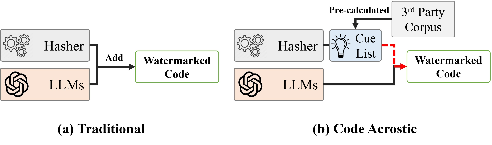
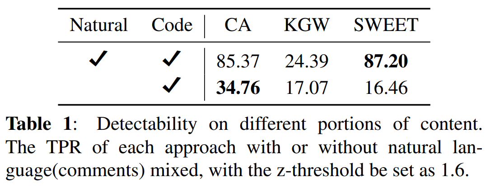

# code-acrostic
 This is the code repo for the paper, "Code Acrostic"

# Introduction
The proposed method can embed watermarks into languages with high entropy variation, such as programming languages.

# Reproduction
We provide a jupyter notebook file for quick reproduction of out result, and we highly recommend to run it with Google Colab.

